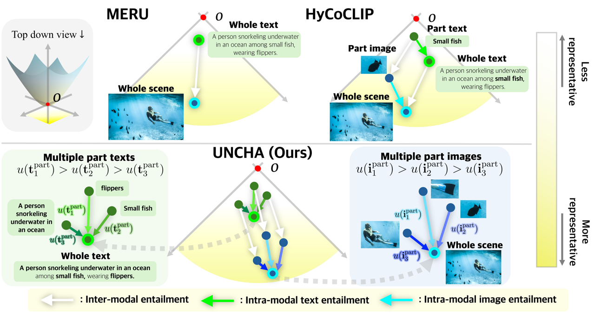

# UNCHA: UNcertainty-guided Compositional Hyperbolic Alignment (CVPR 2026 Highlight)

### [Project Page](https://jeeit17.github.io/UNCHA-project_page/) | [Paper](https://arxiv.org/abs/2603.22042) | [Code](https://github.com/jeeit17/UNCHA) | [Models](https://huggingface.co/hayeonkim/uncha)

PyTorch implementation of uncertainty-guided part-to-whole alignment in hyperbolic vision-language models.

[UNCHA: Uncertainty-guided Compositional Alignment with Part-to-Whole Semantic Representativeness in Hyperbolic Vision-Language Models](https://jeeit17.github.io/UNCHA-project_page/)  
[Hayeon Kim](https://janeyeon.github.io)\*<sup>1</sup>,
[Ji Ha Jang](https://jeeit17.github.io)\*<sup>1</sup>,
[Junghun James Kim](https://www.linkedin.com/in/james-hun-kim-a4682b106/)<sup>2</sup>,
[Se Young Chun](https://icl.snu.ac.kr/pi)<sup>1,2</sup>  
<sup>1</sup>Dept. of Electrical and Computer Engineering, <sup>2</sup>INMC & IPAI  
Seoul National University, Republic of Korea  
\*denotes equal contribution


## What is UNCHA?

<p align="center">
  
</p>

Hyperbolic Vision-Language Models (VLMs) embed images and text in hyperbolic space to capture hierarchical part-whole relationships (e.g., a "street" scene contains parts like "cars", "people", "traffic signs"). However, **not all parts represent the whole scene equally** — a part showing the main street is far more representative than a tiny traffic sign in the corner.

UNCHA models this *part-to-whole semantic representativeness* as **hyperbolic uncertainty**:

- **Low uncertainty** → the part is highly representative of the whole scene (closer to the whole in meaning)
- **High uncertainty** → the part is less representative (e.g., a blurry crop or a minor background object)

This uncertainty is incorporated into:

1. **Contrastive loss** — adaptive temperature scaling so representative parts contribute more to alignment (Eq. 10-11)
2. **Entailment loss** — uncertainty calibration with entropy regularization for well-structured hyperbolic embeddings (Eq. 14-17)

The result: more accurate part-whole ordering in hyperbolic space, better compositional understanding, and state-of-the-art performance on zero-shot classification, retrieval, and multi-label benchmarks.


## Setup

### Dependencies

- Python >= 3.9
- PyTorch >= 2.0
- torchvision
- transformers

Create the environment by running:

```bash
conda create -n uncha python=3.9
conda activate uncha
python -m pip install --pre timm
python -m pip install -r requirements.txt
python setup.py develop
```


## Running code


### Set-up training data - GRIT

Firstly, the raw GRIT dataset (in webdataset format) has to be downloaded following instructions of [huggingface/zzliang/GRIT](https://huggingface.co/datasets/zzliang/GRIT). The dataset contains 20.5M grounded vision-language pairs and 35.9M part-level annotations. For faster training we pre-process the dataset by extracting out box information of each sample by running the following command:

```bash
python utils/prepare_GRIT_webdataset.py --raw_webdataset_path datasets/train/GRIT/raw \
    --processed_webdataset_path datasets/train/GRIT/processed \
    --max_num_processes 12
```


### Training

To train UNCHA with ViT-S/16 backbone:

```bash
./scripts/train.sh --config configs/train_uncha_vit_s.py --num-gpus 4 --output-dir ./train_results/test --checkpoint-period 10000
```

To train with ViT-B/16 backbone:

```bash
./scripts/train.sh --config configs/train_uncha_vit_b.py --num-gpus 4 --output-dir ./train_results/test --checkpoint-period 10000
```

Training uses 4 NVIDIA A100 GPUs with a total batch size of 768 and runs for 500K iterations.

### Evaluation

#### Zero-shot image classification

```bash
python scripts/evaluate.py --config configs/eval_zero_shot_classification.py \
    --checkpoint-path /path/to/your/ckpt \
    --train-config configs/train_uncha_vit_b.py
```

We evaluate on 16 benchmark datasets: ImageNet, CIFAR-10/100, SUN397, Caltech-101, STL-10, Food-101, CUB, Cars, Aircraft, Pets, Flowers, DTD, EuroSAT, RESISC45, and Country211.

#### Zero-shot retrieval

```bash
python scripts/evaluate.py --config configs/eval_zero_shot_retrieval.py \
    --checkpoint-path /path/to/your/ckpt \
    --train-config configs/train_uncha_vit_b.py
```

#### Hierarchical classification

```bash
python scripts/evaluate.py --config configs/eval_hierarchical_metrics.py \
    --checkpoint-path /path/to/your/ckpt \
    --train-config configs/train_uncha_vit_b.py
```

### Pretrained models

| Model | Backbone | ImageNet Acc. | COCO R@1 (Text) | COCO R@1 (Image) |
|-------|----------|:------------:|:----------------:|:-----------------:|
| UNCHA | [ViT-S/16](https://huggingface.co/hayeonkim/uncha/resolve/main/uncha_vit_s.pth?download=true) | 43.9 | 69.9 | 56.2 |
| UNCHA | [ViT-B/16](https://huggingface.co/hayeonkim/uncha/resolve/main/uncha_vit_b.pth?download=true) | 48.8 | 72.7 | 60.0 |

## Method overview

<p align="center">
  
</p>

UNCHA introduces uncertainty to explicitly quantify how well each part represents the whole scene. By assigning lower uncertainty to more representative parts and higher uncertainty to less informative ones, it enables adaptive weighting in the contrastive objective, leading to improved part–whole alignment. Furthermore, uncertainty is calibrated through the entailment loss and regularized by entropy, ensuring stable and balanced use of the hyperbolic embedding space. Together, these components allow UNCHA to achieve more effective compositional understanding and alignment. See our [paper](https://arxiv.org/abs/2603.22042) for full derivations.


## Results

### Zero-shot classification (ViT-B/16)

| Method | ImageNet | CIFAR-10 | CIFAR-100 | SUN397 | Caltech-101 | STL-10 |
|--------|:--------:|:--------:|:---------:|:------:|:-----------:|:------:|
| CLIP   | 40.6 | 78.9 | 48.3 | 43.0 | 70.7 | 92.4 |
| MERU   | 40.1 | 78.6 | 49.3 | 43.0 | 73.0 | 92.8 |
| HyCoCLIP | 45.8 | 88.8 | 60.1 | 57.2 | 81.3 | 95.0 |
| **UNCHA (Ours)** | **48.8** | **90.4** | **63.2** | **57.7** | **83.9** | **95.7** |

### Multi-object representation (ViT-B/16, mAP)

| Method | ComCo 2obj | ComCo 5obj | SimCo 2obj | SimCo 5obj | VOC | COCO |
|--------|:----------:|:----------:|:----------:|:----------:|:---:|:----:|
| CLIP   | 77.55 | 80.22 | 77.15 | 88.48 | 78.56 | 53.94 |
| HyCoCLIP | 72.90 | 72.90 | 75.71 | 82.85 | 80.43 | 58.12 |
| **UNCHA (Ours)** | **77.92** | **81.18** | **79.72** | **90.65** | **82.14** | **59.43** |


## Citation

If you find this work useful, please cite:

```bibtex
@inproceedings{kim2026uncha,
  author    = {Kim, Hayeon and Jang, Ji Ha and Kim, Junghun James and Chun, Se Young},
  title     = {UNCHA: Uncertainty-guided Compositional Hyperbolic Alignment with Part-to-Whole Semantic Representativeness},
  booktitle = {CVPR},
  year      = {2026},
}

```


## Acknowledgements

This work was supported by IITP grants funded by the Korea government (MSIT), NRF grants funded by the Korea government (MSIT), the AI Computing Infrastructure Enhancement (GPU Rental Support) Program funded by MSIT, the BK21 FOUR Program at Seoul National University, and the AI-Bio Research Grant through Seoul National University. We also thank the authors of [MERU](https://github.com/facebookresearch/meru), [HyCoCLIP](https://github.com/PalAvik/hycoclip), and [ATMG](https://github.com/samgregoost/atmg) for their open-source implementations.# UNCHA
